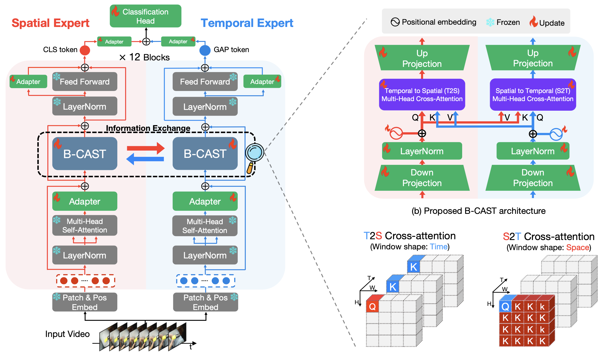
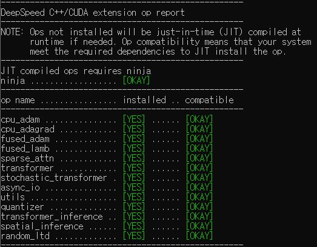

# CAST: Cross-Attention in Space and Time for Video Action Recognition [[NeurIPS 2023](https://neurips.cc/virtual/2023/poster/70748)][[Project Page](https://jong980812.github.io/CAST.github.io)][[Arxiv](https://arxiv.org/abs/2311.18825)]


<br>


[](https://paperswithcode.com/sota/action-recognition-on-epic-kitchens-100?p=cast-cross-attention-in-space-and-time-for-1)

<br>
<br>

<br>


# :wrench: Installation

We conduct all the experiments with 16 NVIDIA GeForce RTX 3090 GPUs.
First, install PyTorch 1.10.0+ and torchvision 0.11.0.

```
conda create -n vmae_1.10  python=3.8 ipykernel -y
conda activate vmae_1.10
conda install pytorch==1.10.0 torchvision==0.11.0 torchaudio==0.10.0 -c pytorch
```
Then, install timm, triton, DeepSpeed, and others.
```
pip install triton==1.0.0
git clone https://github.com/microsoft/DeepSpeed
cd DeepSpeed
git checkout 3a3dfe66bb
DS_BUILD_OPS=1 pip install . --global-option="build_ext"
pip install TensorboardX decord einops scipy pandas requests
ds_report
```

If you have successfully installed Deepspeed, after running the 'ds_report' command, you can see the following results.
For other Deepspeed-related issues, please refer to the [DeepSpeed GitHub page](https://github.com/microsoft/DeepSpeed).



# :file_folder: Data Preparation

 * We report experimental results on three standard datasets.([EPIC-KITCHENS-100](https://epic-kitchens.github.io/2023), [Something-Something-V2](https://developer.qualcomm.com/software/ai-datasets/something-something), [Kinetics400](https://deepmind.com/research/open-source/kinetics))
 * We provide sample annotation files -> [annotations](./annotations/).

### EPIC-KITCHENS-100
- The pre-processing of **EPIC-KITCHENS-100** can be summarized into 3 steps:

  1. Download the dataset from [official website](https://github.com/epic-kitchens/epic-kitchens-download-scripts).

  2.  Preprocess the dataset by resizing the short edge of video to **256px**. You can refer to [MMAction2 Data Benchmark](https://github.com/open-mmlab/mmaction2).

  3. Generate annotations needed for dataloader ("<video_id>,<verb_class>,<noun_class>" in annotations). The annotation usually includes `train.csv`, `val.csv`. The format of `*.csv` file is like:<br>
 

     ```
     video_1,verb_1,noun_1
     video_2,verb_2,noun_2
     video_3,verb_3,noun_3
     ...
     video_N,verb_N,noun_N
     ```
  4. All video files are located inside the DATA_PATH.

### Something-Something-V2
- The pre-processing of **Something-Something-V2** can be summarized into 3 steps:

  1. Download the dataset from [official website](https://developer.qualcomm.com/software/ai-datasets/something-something).

  2. Preprocess the dataset by changing the video extension from `webm` to `.mp4` with the **original** height of **240px**. You can refer to [MMAction2 Data Benchmark](https://github.com/open-mmlab/mmaction2).

  3. Generate annotations needed for dataloader ("<video_id> <video_class>" in annotations). The annotation usually includes `train.csv`, `val.csv` and `test.csv`. The format of `*.csv` file is like:

     ```
     video_1.mp4  label_1
     video_2.mp4  label_2
     video_3.mp4  label_3
     ...
     video_N.mp4  label_N
     ```
  4. All video files are located inside the DATA_PATH.
### Kinetics-400
- The pre-processing of **Kinetics400** can be summarized into 3 steps:

  1. Download the dataset from [official website](https://deepmind.com/research/open-source/kinetics) or [OpenDataLab](https://opendatalab.com/OpenMMLab/Kinetics-400).

  2. Preprocess the dataset by resizing the short edge of video to **320px**. You can refer to [MMAction2 Data Benchmark](https://github.com/open-mmlab/mmaction2).

  3. Generate annotations needed for dataloader ("<video_id> <video_class>" in annotations). The annotation usually includes `train.csv`, `val.csv` and `test.csv`. The format of `*.csv` file is like:

     ```
     video_1.mp4  label_1
     video_2.mp4  label_2
     video_3.mp4  label_3
     ...
     video_N.mp4  label_N
     ```
     <br>
 4. All video files should be splited into **DATA_PATH/train** and **DATA_PATH/val**.
# Expert model preparation
We use the pre-trained weights of spatial and temporal experts. The pretrained weight of the spatial expert (CLIP) uses the [official weight](https://openaipublic.azureedge.net/clip/models/5806e77cd80f8b59890b7e101eabd078d9fb84e6937f9e85e4ecb61988df416f/ViT-B-16.pt). The pre-trained weight of the temporal expert (VideoMAE) uses the pre-trained weights from the three datasets EK100, K400, and SSV2. Of these, [K400](https://drive.google.com/file/d/1MzwteHH-1yuMnFb8vRBQDvngV1Zl-d3z/view?usp=sharing) and [SSV2](https://drive.google.com/file/d/1dt_59tBIyzdZd5Ecr22lTtzs_64MOZkT/view?usp=sharing) use the [official weights](https://github.com/potatowarriors/VideoMAE/blob/main/MODEL_ZOO.md), and [EK100](https://drive.google.com/file/d/16zDs_9ycAoz8AoEecrQXsC5vLZsaQoTw/view?usp=sharing) uses the weights we pre-trained ourselves. Put each downloaded expert weight into the VMAE_PATH and CLIP_PATH of the fine-tune script.


# Fine-tuning CAST

We provide the **off-the-shelf** scripts in the [scripts folder](scripts).

-  For example, to fine-tune CAST on **Kinetics400** with 16 GPUs (2 nodes x 8 GPUs) script.

  ```bash
DATA_PATH=YOUR_PATH
VMAE_MODEL_PATH=YOUR_PATH
CLIP_MODEL_PATH=YOUR_PATH


OMP_NUM_THREADS=1 python -m torch.distributed.launch \
    --nproc_per_node=2 \
    --master_port ${YOUR_NUMBER} --nnodes=8 \
    --node_rank=${YOUR_NUMBER} --master_addr=${YOUR_NUMBER} \
    YOUR_PATH/run_bidirection_compo.py \
    --data_set Kinetics-400 \
    --nb_classes 400 \
    --vmae_model compo_bidir_vit_base_patch16_224 \
    --anno_path ${ANNOTATION_PATH}
    --data_path ${DATA_PATH} \
    --clip_finetune ${CLIP_MODEL_PATH} \
    --vmae_finetune ${VMAE_MODEL_PATH} \
    --log_dir ${YOUR_PATH} \
    --output_dir ${YOUR_PATH} \
    --batch_size 6 \
    --input_size 224 \
    --short_side_size 224 \
    --save_ckpt_freq 25 \
    --num_sample 1 \
    --num_frames 16 \
    --opt adamw \
    --lr 1e-3 \
    --opt_betas 0.9 0.999 \
    --weight_decay 0.05 \
    --epochs 70 \
    --dist_eval \
    --test_num_segment 5 \
    --test_num_crop 3 \
    --num_workers 8 \
    --drop_path 0.2 \
    --layer_decay 0.75 \
    --mixup_switch_prob 0 \
    --mixup_prob 0.5 \
    --reprob 0. \
    --init_scale 1. \
    --update_freq 6 \
    --seed 0 \
    --enable_deepspeed \
    --warmup_epochs 5 \
  ```
# Evaluation
Evaluation commands for the EK100.
```
python ./run_bidirection_compo.py --fine_tune {YOUR_FINETUNED_WEIGHT} --composition --eval
```
Evaluation commands for the SSV2, K400.
```
python ./run_bidirection.py --fine_tune {YOUR_FINETUNED_WEIGHT} --eval
```
# Model Zoo

### EPIC-KITCHENS-100

|  Method  | Spatial Expert | Temporal expert | Epoch | \#Frames x Clips x Crops |                          Fine-tune                           | Top-1 |
| :------: | :------: | :------: | :---: | :-----: | :----------------------------------------------------------: | :---: |
| CAST |  [CLIP-B/16](https://openaipublic.azureedge.net/clip/models/5806e77cd80f8b59890b7e101eabd078d9fb84e6937f9e85e4ecb61988df416f/ViT-B-16.pt)   | [VideoMAE-B/16 (pre-trained on EK100)](https://drive.google.com/file/d/1DaxOctpEkmKTi873J1jzzz_Sl-0wRai7/view?usp=sharing) |  50  | 16x2x3  | [log](https://drive.google.com/file/d/1yry2Nd5BEaX3kZjNYDghGHubpei-by_9/view?usp=sharing)/[checkpoint](https://drive.google.com/file/d/1pW5tMWG2N5zqQOOPcrawwQpIAhPFMoVx/view?usp=sharing)<br />| 49.3  |
### Something-Something V2

|  Method  | Spatial Expert | Temporal expert | Epoch | \#Frames x Clips x Crops |                          Fine-tune                           | Top-1 |
| :------: | :------: | :------: | :---: | :-----: | :----------------------------------------------------------: | :---: |
| CAST |  [CLIP-B/16](https://openaipublic.azureedge.net/clip/models/5806e77cd80f8b59890b7e101eabd078d9fb84e6937f9e85e4ecb61988df416f/ViT-B-16.pt)   | [VideoMAE-B/16 (pre-trained on SSV2)](https://drive.google.com/file/d/1dt_59tBIyzdZd5Ecr22lTtzs_64MOZkT/view?usp=sharing) |  50  | 16x2x3  | [log](https://drive.google.com/file/d/1wOjcXSen9B9R2CIQ8ge7HrRufr_MmMcN/view?usp=sharing)/[checkpoint](https://drive.google.com/file/d/1RrAVF4tlpZCPYNY49M0pKQfopP6p6Vir/view?usp=sharing)<br /> | 71.6  |

### Kinetics-400

|  Method  | Spatial Expert | Temporal expert | Epoch | \#Frames x Clips x Crops |                          Fine-tune                           | Top-1 |
| :------: | :------: | :------: | :---: | :-----: | :----------------------------------------------------------: | :---: |
| CAST |  [CLIP-B/16](https://openaipublic.azureedge.net/clip/models/5806e77cd80f8b59890b7e101eabd078d9fb84e6937f9e85e4ecb61988df416f/ViT-B-16.pt)   | [VideoMAE-B/16 (pre-trained on K400)](https://drive.google.com/file/d/1MzwteHH-1yuMnFb8vRBQDvngV1Zl-d3z/view?usp=sharing) |  70  | 16x5x3  | [log](https://drive.google.com/file/d/1Npw-GblhSGWVx0nU06ztjDLMFcazeCx6/view?usp=sharing)/[checkpoint](https://drive.google.com/file/d/16ndsBVNjRuJMRM40P0-a3Q1JVA8tNLK7/view?usp=sharing)<br />| 85.3  |


## Acknowledgements

This project is built upon [VideoMAE](https://github.com/MCG-NJU/VideoMAE), [MAE](https://github.com/pengzhiliang/MAE-pytorch), [CLIP](https://github.com/openai/CLIP) and [BEiT](https://github.com/microsoft/unilm/tree/master/beit). Thanks to the contributors of these great codebases.

## License

This project is under the CC-BY-NC 4.0 license. See [LICENSE](https://github.com/MCG-NJU/VideoMAE/blob/main/LICENSE) for details.

## Citation
```
@article{cast,
  title={CAST: Cross-Attention in Space and Time for Video Action Recognition},
  author={Lee, Dongho and Lee, Jongseo and Choi, Jinwoo},
  booktitle={NeurIPS}},
  year={2023}
```
